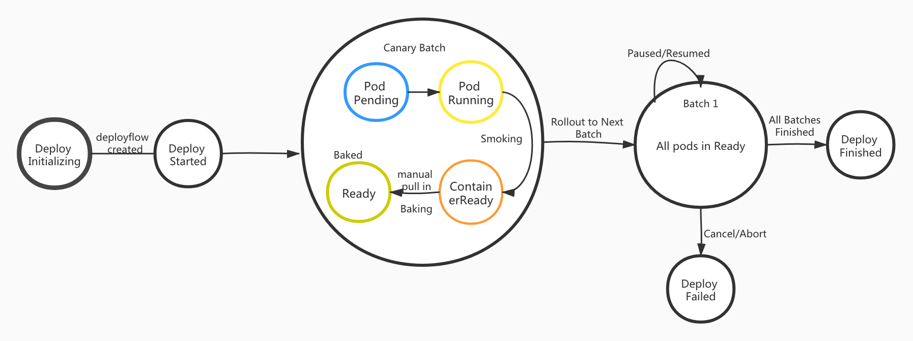

# Deploy Nginx App using DeployFlow 

This tutorial walks you through an example to deploy a Nginx application using DeployFlow, show the detailed deploy process.

**Setup host**

1. make sure `kube-apiserver` could connect to your local machine.
2. make sure the `OpenKruise` has been installed in your cluster. If not, install it according to [this doc](https://openkruise.io/en-us/docs/installation.html).
3. make sure the `Triton` has been installed in your cluster. If not, install it by `make install`.
4. make sure the `Triton controller` running.
5. make sure you have install [grpcurl](https://github.com/fullstorydev/grpcurl)

## Installing the Nginx DeployFlow

There are two ways to create a DeployFlow:
1. just using `kubectl apply -f `
2. also, triton provides REST & GRPC API to handle deploy process, using the next API to create a DeployFlow
```bash
curl --location --request POST 'localhost:8088/api/v1/namespaces/default/deployflows' \
--header 'Content-Type: application/json' \
--data-raw '{
    "applicationSpec": {
        "appID": 12122,
        "groupID": 10010,
        "appName": "deploy-demo-hello",
        "instanceName": "12122-sample-10010",
        "template": {
            "spec": {
                "containers": [
                    {
                        "name": "12122-sample-10010-container",
                        "image": "nginx:latest",
                   
                        "readinessGates": [
                            {
                                "conditionType": "apps.triton.io/ready"
                            }
                        ],
                    
                        "ports": [
                            {
                                "containerPort": 80
                            }
                        ]
                    }
                ]
            }
        },
        "replicas": 3
    },
    "updateStrategy": {
        "batchSize": 1,
        "canary": 1,
        "mode": "auto"
    }
}'
```

Then we create the service of this application:
```bash
kubectl apply -f 
```

## Verify DeployFlow Started

Check the DeployFlow started. `deployflows.apps.triton.io` or shortname `df` is the resource kind.
```bash
❯ kubectl get df
NAME                    REPLICAS   UPDATED_READY_REPLICAS   FINISHED_REPLICAS   PHASE          BATCHES   CURRENT_BATCH_SIZE   AGE
12122-sample-10010-df   1          0                        0                   BatchStarted   3         1                    3s

❯ kubectl get svc | grep sample
sample-12122-svc       ClusterIP      10.22.12.133   <none>           80/TCP           7s
```

The DeployFlow `12122-sample-10010-df` has been started and is handling the canary batch, you can check it by `kubectl get df 12122-sample-10010-df -o yaml`

## Move forward the canary batch from Smoked to Baking
Wait until the Pod of canary batch in `ContainerReady` status, but `Ready` condition is false.
That means the canary batch is in `Smoked` phase, but not pulled in `Service` (the Endpoints of svc has none value) because the  `ReadinessGate` - `apps.triton.io/ready` not set true.


The DeployFlow will be paused in `Smoked` phase of canary batch until you make it to next by calling `Next API`:
```bash
❯ grpcurl --plaintext -d '{"deploy":{"name":"12122-sample-10010-df","namespace":"default"}}' localhost:8099 deployflow.DeployFlow/Next
{
  "deploy": {
    "namespace": "default",
    "name": "12122-sample-10010-df",
    "appID": 12122,
    "groupID": 10010,
    "appName": "deploy-demo-hello",
    "instanceName": "12122-sample-10010",
    "replicas": 3,
    "action": "create",
    "updatedReplicas": 1,
    "updateRevision": "6ddf9b7cf4",
    "conditions": [
      {
        "batch": 1,
        "batchSize": 1,
        "canary": true,
        "phase": "Smoked",
        "pods": [
          {
            "name": "12122-sample-10010-qllmx",
            "ip": "172.31.229.199",
            "port": 80,
            "phase": "ContainersReady"
          }
        ],
        "startedAt": "2021-09-08T09:14:33Z",
        "finishedAt": "0001-01-01T00:00:00Z"
      }
    ],
    "phase": "BatchStarted",
    "batches": 3,
    "batchSize": 1,
    "startedAt": "2021-09-08T09:14:33Z",
    "finishedAt": "0001-01-01T00:00:00Z",
    "mode": "auto",
    "canary": 1,
    "updatedAt": "2021-09-08T09:15:10Z"
  }
}
```

After calling `Next` GRPC API, the Pod become `Ready` status so Pod `12122-sample-10010-qllmx` show in service `Endpoints` field.
```bash
❯ kubectl describe svc sample-12122-svc
Name:              sample-12122-svc
Namespace:         default
Labels:            app=12122
                   app.kubernetes.io/instance=12122-sample-10010
                   app.kubernetes.io/name=deploy-demo-hello
                   group=10010
                   managed-by=triton-io
Annotations:       <none>
Selector:          app.kubernetes.io/instance=12122-sample-10010,app.kubernetes.io/name=deploy-demo-hello,app=12122,group=10010,managed-by=triton-io
Type:              ClusterIP
IP Families:       <none>
IP:                10.22.12.133
IPs:               <none>
Port:              web  80/TCP
TargetPort:        80/TCP
Endpoints:         172.31.229.199:80
Session Affinity:  None
Events:            <none>
```

This means that the Pod has been pulled into the Service to formally work.

## Rollout to the next batches
By now, the canary batch has been deployed successfully. The filed `UPDATED_READY_REPLICAS` has been changed from o to 1.

```bash
❯ kubectl get df
NAME                    REPLICAS   UPDATED_READY_REPLICAS   FINISHED_REPLICAS   PHASE          BATCHES   CURRENT_BATCH_SIZE   AGE
12122-sample-10010-df   1          1                        0                   BatchStarted   3         1                    3h10m
```


Then we call the `Next` GRPC API again to rollout to the next batch.

```bash
❯ grpcurl --plaintext -d '{"deploy":{"name":"12122-sample-10010-df","namespace":"default"}}' localhost:8099 deployflow.DeployFlow/Next
```

The canary batch will enter the baked phase, and the second batch will enter the Pending phase.At this time, you can check whether the traffic on the service is normal.
And if all things ok, call `Next` API to start the next batch.

```bash
grpcurl --plaintext -d '{"deploy":{"name":"12122-sample-10010-df","namespace":"default"}}' localhost:8099 deployflow.DeployFlow/Next
```

Because we use `auto` mode, the remaining two batches will be completed automatically.
After all three batches are completed, DeployFlow will become Success status.

```bash
❯ kubectl get df
NAME                    REPLICAS   UPDATED_READY_REPLICAS   FINISHED_REPLICAS   PHASE     BATCHES   CURRENT_BATCH_SIZE   AGE
12122-sample-10010-df   3          3                        3                   Success   3         1                    3h23m

❯ kubectl get clone 12122-sample-10010
NAME                 DESIRED   UPDATED   UPDATED_READY   READY   TOTAL   AGE
12122-sample-10010   3         3         3               3       3       3h27m
```

We can see the `UPDATED_READY_REPLICAS` is 3 and `PHASE` is Success, and the status of cloneset is normal.
Also, the service of this application is ok.

Check the service in k8s cluster:

```bash
# curl sample-12122-svc
<!DOCTYPE html>
<html>
<head>
<title>Welcome to nginx!</title>
<style>
    body {
        width: 35em;
        margin: 0 auto;
        font-family: Tahoma, Verdana, Arial, sans-serif;
    }
</style>
</head>
<body>
<h1>Welcome to nginx!</h1>
<p>If you see this page, the nginx web server is successfully installed and
working. Further configuration is required.</p>

<p>For online documentation and support please refer to
<a href="http://nginx.org/">nginx.org</a>.<br/>
Commercial support is available at
<a href="http://nginx.com/">nginx.com</a>.</p>

<p><em>Thank you for using nginx.</em></p>
</body>
</html>
```

## Complete DeployFlow status transfer demonstration


## Pause/Continue the DeployFlow
During the deploy process, if you want to pause the DeployFlow, use:
```bash
grpcurl --plaintext -d '{"deploy":{"name":"12122-sample-10010-df","namespace":"default"}}' localhost:8099 deployflow.DeployFlow/Pause
```

If you want to continue, just use:
```bash
grpcurl --plaintext -d '{"deploy":{"name":"12122-sample-10010-df","namespace":"default"}}' localhost:8099 deployflow.DeployFlow/Resume
```

## Cancel the DeployFlow
If you found the Pod failed or crash and want to cancel this DeployFlow, use:
```bash
grpcurl --plaintext -d '{"deploy":{"name":"12122-sample-10010-df","namespace":"default"}}' localhost:8099 deployflow.DeployFlow/Cancel
```

By now the application has been deployed to k8s cluster successfully. The deploy process is clear and controllable.

The deploy strategy also support other action, such as update, scale, restart
## Make an update DeployFlow
The `update` DeployFlow is the same sa `create`, except the action is `update`.


## Make a scale DeployFlow
You can also divide several batches to scale your cloneset using `auto` or `mannual` mode. 
When a CloneSet is scaled down, sometimes user has preference to deleting specific Pods, you can use `podsToDelete` field.

```bash

grpcurl --plaintext -d '{"instance":{"name":"12122-sample-10010","namespace":"default"},"replicas":2,"strategy":{"mode":"auto","batchSize":"10","podsToDelete":["12122-sample-10010-q749z"],"batches":"1","batchIntervalSeconds":10}}' \
localhost:8099 application.Application/Scale
```
